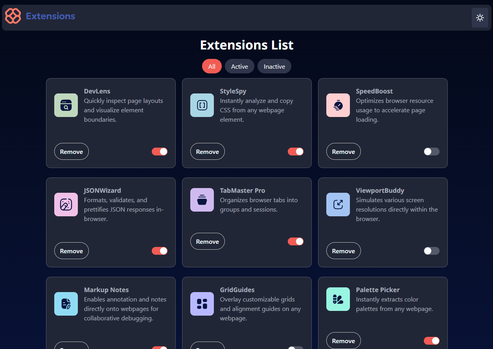
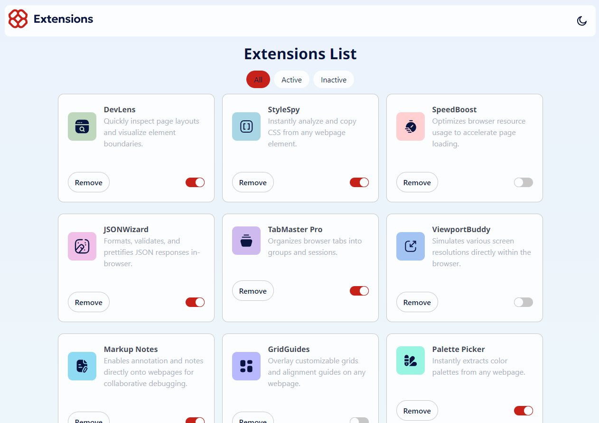

# Frontend Mentor - Browser extensions manager UI solution

This is a solution to the [Browser extensions manager UI challenge on Frontend Mentor](https://www.frontendmentor.io/challenges/browser-extension-manager-ui-yNZnOfsMAp). Frontend Mentor challenges help you improve your coding skills by building realistic projects. 

## Table of contents

- [Overview](#overview)
  - [The challenge](#the-challenge)
  - [Screenshot](#screenshot)
  - [Links](#links)
- [My process](#my-process)
  - [Built with](#built-with)
  - [What I learned](#what-i-learned)
  - [Continued development](#continued-development)
  - [Useful resources](#useful-resources)
- [Author](#author)

## Overview

### The challenge

Users should be able to:

- Toggle extensions between active and inactive states
- Filter active and inactive extensions
- Remove extensions from the list
- Select their color theme
- View the optimal layout for the interface depending on their device's screen size
- See hover and focus states for all interactive elements on the page

### Screenshot



### Links

- Solution URL: [Solution](https://www.frontendmentor.io/solutions/browser-extension-manager-bulma-QrmG4tAvmJ)
- Live Site URL: [Live site](https://github.com/DrMetr/Browser-extension-manager-challenge)

## My process

I strated with dynamically populating the page using JS. Then building all the other layout with Bulma and CSS. Then wrote the buttons behaviour. Then implemented dark and light mode. Then grid layout for mobile, desktop and tablet (two columns instead of one). 

Since there was no dark mode logo provided I've decided to mask it using filter.

### Built with

- Semantic HTML5 markup
- CSS custom properties
- Flexbox
- CSS Grid
- Mobile-first workflow
- Bulma
- Vanilla JavaScript

### What I learned

This was a big and full of new experience project and I'm happy to finish it. I've encountered plenty of issues that were completely new for me and haven't resolved some of them.

First thing I learned was how to use fetch() with .json files to dynamically populate the page. Maybe, it's not really the best code I've written but it's good for now.

Second thing I learned was using Bulma framework. Frankly, I didn't really like it, doesn't seem much different to Bootstrap and it won't apply grid properly. 

Grid was another thing I learned. As well as filter property.

And finally, I learned how to customise dark and light modes. I didn't know about ```:root[data-theme="light"]``` and ```@media (prefers-color-scheme: dark)``` (which I avoided touching in my project).

Along the way from a dark/light mode tutorial I found, I learned making code like the following:

let icon = document.querySelector("#theme_icon").getAttribute("src");
  document.querySelector("#theme_icon").setAttribute("src",
    icon === "assets/images/icon-sun.svg" ? "assets/images/icon-moon.svg":"assets/images/icon-sun.svg"
  );

Looks convenient to me.

### Continued development

Next time I'll either try Tailwind, either linger at Bootstrap for a while. Gradient background being cut is still a mystery to me.

### Useful resources

- [Темный режим и как его лучше делать](https://frontendtoday.ru/articles/dark-mode-best-practice/) - where I stole the theme changing code.

## Author

- Website - [Add your name here](https://www.your-site.com)
- Frontend Mentor - [@DrMetr](https://www.frontendmentor.io/profile/DrMetr)
